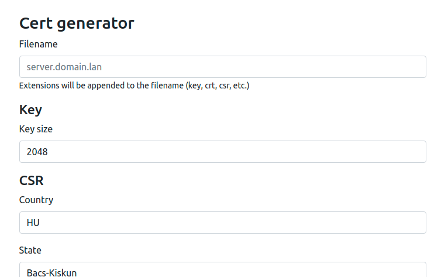

## PVGA Certgen

Simple Laravel web application that helps you creating new self-signed certificates.

### How To

First, you need to make a certificate. This will be used as the root Certificate Authority and this tool
will make certificates that will be based on that.

Put your CA's .key and .pem files to the storage folder as `pvga_ca.key` and `pvga_ca.pem`.

You can install this CA to your trusted certificates store, so the generated certificates will be recognized as
trusted.

### Requirements

- Linux
- PHP 7.3 or newer
- php-zip extension
- openssl

### Starting up

- `composer install`
- `php artisan serve`

For production use check out the [Laravel deployment documentation](https://laravel.com/docs/8.x/deployment).
